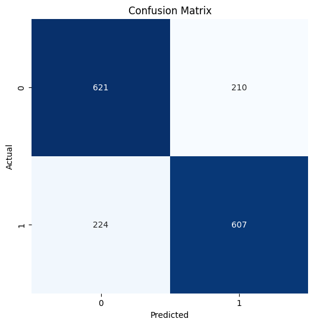
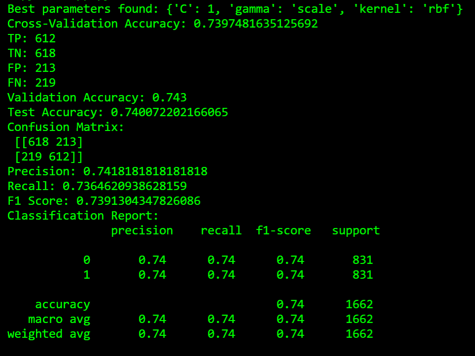

# Sentiment Analysis with Support Vector Machine (SVM)

This project implements a sentiment analysis model using a Support Vector Machine (SVM) to classify movie reviews as positive or negative. The model is built using Python and various libraries, including Scikit-learn, Pandas, and Matplotlib.

## Table of Contents
1. [Introduction](#introduction)
2. [Requirements](#requirements)
3. [Data](#data)
4. [Installation](#installation)
5. [Usage](#usage)
6. [Model Training](#model-training)
   - [Preprocessing](#preprocessing)
   - [Feature Extraction](#feature-extraction)
   - [Splitting the Data](#splitting-the-data)
   - [Hyperparameter Tuning](#hyperparameter-tuning)
   - [Model Evaluation](#model-evaluation)
7. [Results](#results)
8. [Conclusion](#conclusion)
9. [License](#license)

## Introduction

Sentiment analysis is a Natural Language Processing (NLP) technique used to determine the emotional tone behind a body of text. In this project, we will classify movie reviews from the Rotten Tomatoes dataset into positive and negative categories using an SVM classifier. 

## Requirements

To run this project, you need to have Python installed along with the following libraries:

- pandas
- scikit-learn
- matplotlib
- seaborn

You can install the required libraries using pip:

```bash
pip install pandas scikit-learn matplotlib seaborn
```

## Data

The dataset used in this project consists of movie reviews labeled as positive or negative. It includes two files:

- `rt-polarity.pos`: Contains positive movie reviews.
- `rt-polarity.neg`: Contains negative movie reviews.

Make sure to place these files in the same directory as the script.

## Installation

1. Clone this repository:

   ```bash
   git clone https://github.com/Priyanshuiiitg/sentiment-analysis-svm.git
   cd sentiment-analysis-svm
   ```

2. Ensure you have all the required libraries installed (as mentioned above).

## Usage

1. Place the `rt-polarity.pos` and `rt-polarity.neg` files in the project directory.
2. Run the Python script:

   ```bash
   python app.py
   ```

## Model Training

### Preprocessing

The script preprocesses the text data by:
- Converting text to lowercase.
- Removing special characters and digits.

### Feature Extraction

The `TfidfVectorizer` is used to convert text data into numerical format, focusing on the most relevant features while removing common stop words.

### Splitting the Data

The dataset is split into training, validation, and test sets:
- **Training Set**: 4000 positive and 4000 negative reviews.
- **Validation Set**: 500 positive and 500 negative reviews.
- **Test Set**: Remaining reviews.

### Hyperparameter Tuning

GridSearchCV is used for hyperparameter tuning to find the best parameters for the SVM model. The parameters tuned include:
- `C`: Regularization parameter.
- `kernel`: Type of kernel (linear or RBF).
- `gamma`: Kernel coefficient.

### Model Evaluation

The model's performance is evaluated using:
- Cross-validation scores.
- Accuracy on validation and test sets.
- Confusion matrix to visualize the model's predictions.

## Results

The script will output the following metrics:

- True Positive (TP)
- True Negative (TN)
- False Positive (FP)
- False Negative (FN)
- Validation Accuracy
- Test Accuracy
- Confusion Matrix
- Precision
- Recall
- F1 Score
- Classification Report

The confusion matrix will also be displayed as a heatmap.



## Conclusion

The SVM model provides a robust method for sentiment analysis. By tuning hyperparameters and evaluating the model, we achieve good performance in classifying movie reviews. This approach can be extended to other text classification tasks.

## License

This project is licensed under the MIT License. Feel free to modify and distribute it as you see fit.
```

Feel free to adjust any sections according to your preferences or project specifics, especially the GitHub repository link. You can copy and paste this directly into your README file!
```
